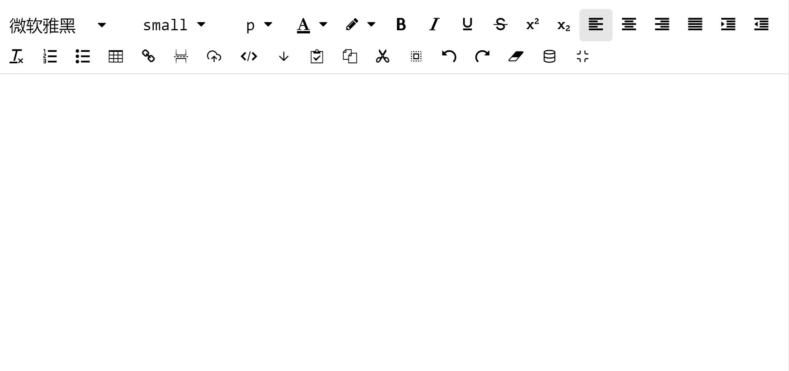
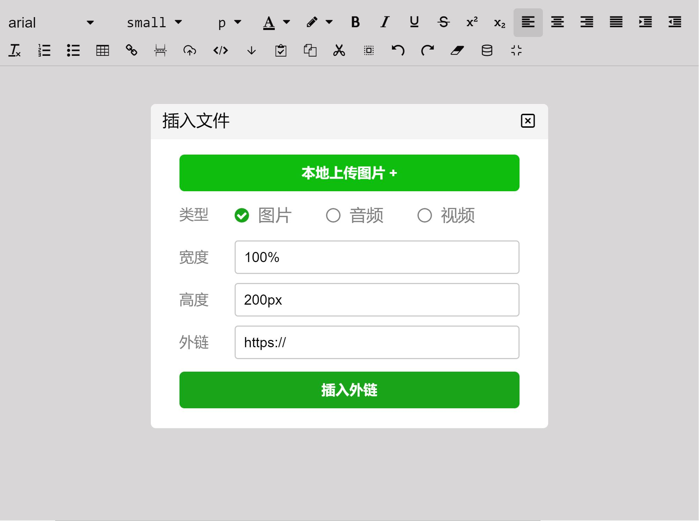

# ZEditor

## Description

一款简单、小清新的编辑器

## UI





## Install

```shell
npm install @bigbigbird/zeditor -S
```

## Quick Start

``` typescript
import Vue from 'vue'
import ZEditor from '@bigbigbird/zeditor'

Vue.component(ZEditor.name, ZEditor)
// or
@Component({
  components: {
    'z-editor': ZEditor
  }
})
export default class NameComponent {
  //...
}
```

``` typescript
/** props */
// 默认没有提交按钮
hasBtn: boolean = false;
// 主题(r-粉红色，g-护眼绿，b-天空蓝，p-紫色)，默认没有主题
theme: 'r'|'g'|'b'|'p' = '';
// 参数配置
options: Object = {
  // 编辑内容的最大字节数
  maxsize: 65535,
  image: {
    // 上传的最大图片或插入图片外链数量
    count: 5,
    // 小于指定字节数会进行base64编码
    base64: 60000
  },
  audio: {
    // 单次上传音频或插入音频外链的最大数量
    count: 1,
    // 小于指定字节数会进行base64编码
    base64: 0
  },
  video: {
    /** 单次上传视频或插入视频外链的最大数量 */
    count: 1,
    /** 小于指定字节数会进行base64编码 */
    base64: 0
  }
}

/** events */
// 输入事件 @input="input($event)"
input(innerHTML: string) {
  //...
}

// 前提hasBtn传入true
// 点击提交按钮事件 @recieveContent="recieveContent($event)"
input(obj: {
  innerHTML: string;
  innerText: string,
  {
    image: { type: 'url'|'base64', src: string},
    audio: { type: 'url'|'base64', src: string},
    video: { type: 'url'|'base64', src: string},
  }
}) {
  //...
}

// 文件上传事件 @uploadFile="uploadFile($event)"
uploadFile(obj: {
  type: 'image' | 'audio' | 'video', file: any, close: Function
}) {
  // type 文件类型
  // file 文件

  // 关闭弹窗的回调
  // 上传成功
  const isSuccess = true;
  close(isSuccess);
  // 上传失败
  const isSuccess = true;
  close(!isSuccess);
  // 上传超时
  const isSuccess = true;
  const t = 3000; // ms
  close(!isSuccess, t);
}
```

``` html
<template>
  <z-editor v-model="innerHTML" :options="options" :hasBtn="false" :theme="g" @input="input($event)" @recieveContent="recieveContent($event)"  @uploadFile="uploadFile($event)"/>
</template>
```

## Problem

使用v-model时，如果需要重新传入innerHTML，请设置一次innerHTML的值为''(空字符串)，因为内部需要记住光标的位置，所以当text有值的时候，并不会重新输入并响应，而重新输入会导致记住的光标无法设置到新的text中。

``` typescript
setInnerHTML(innerHTML: string) {
  this.innerHTML = '';
  this.$nextTick(() => {
    this.innerHTML = innerHTML;
  });
}
```

## Browser Support

Modern browsers and Internet Explorer 9+.

## Security

在前端可以使用xss过滤  
在后端可以使用jsoup过滤

## Concat

QQ:1029512956@qq.com  
name: 木懵の狗纸
